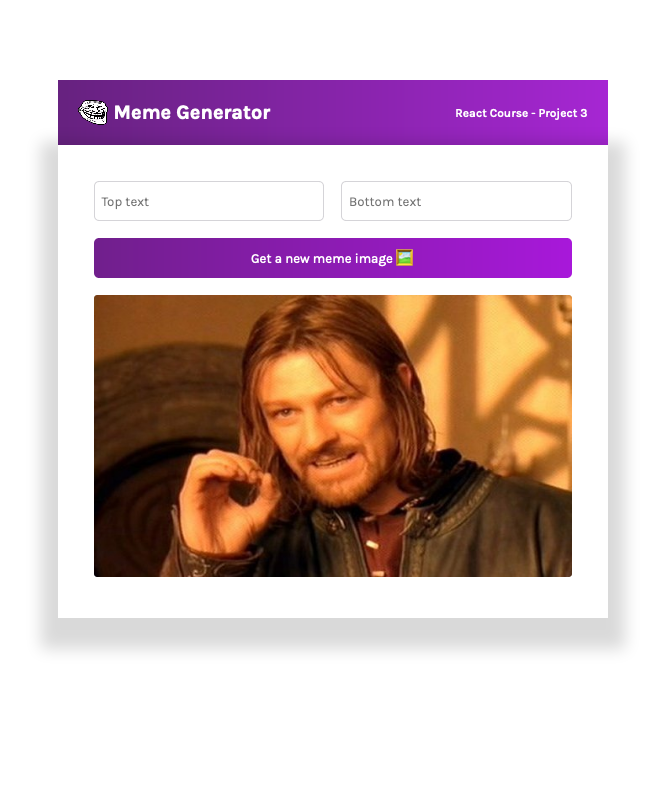
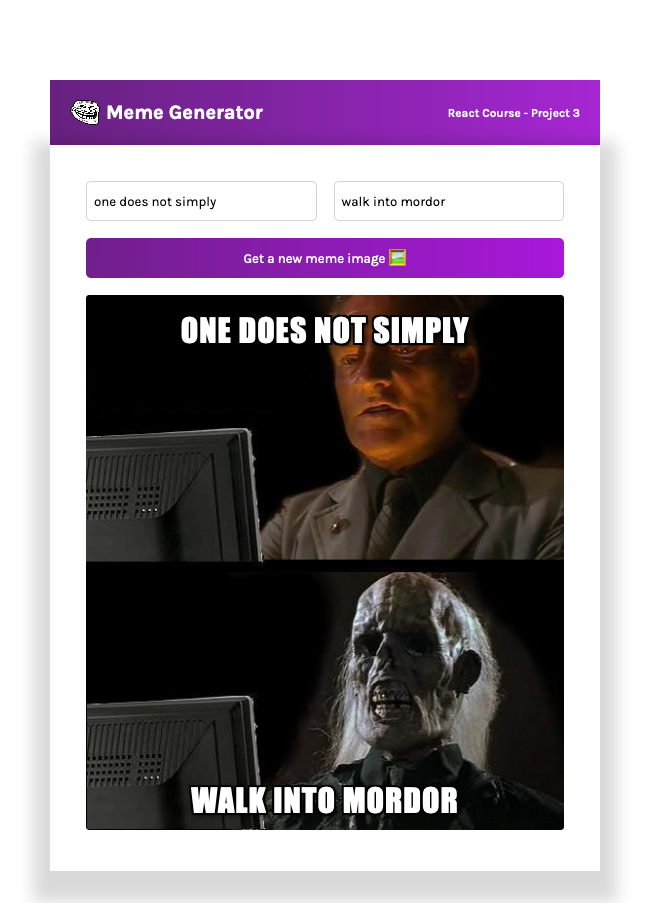

# Scrimba Frontend Career Path - (Meme Generator - Module 11)

This is a solution to the [Scrimba Frontend Career Path - (Module11-Reactbasics/Meme Generator)](https://scrimba.com/learn/frontend).

## Table of contents

- [Overview](#overview)
  - [The challenge](#the-challenge)
  - [Screenshot](#screenshot)
  - [Links](#links)
- [My process](#my-process)
  - [Built with](#built-with)
  - [What I learned](#what-i-learned)
  - [Continued development](#continued-development)
  - [Useful resources](#useful-resources)
- [Author](#author)
- [Acknowledgments](#acknowledgments)


## Overview

### The challenge

Build a meme generator MVP, using react hooks

After this Challenge I should be able to Code/Understand:

React:
- Event listeners
- State
- Conditional rendering
- Forms
- Side effects

### Screenshot




### Links

- Solution Github URL: [github.com/Rod-Barbosa/meme-generator](https://github.com/Rod-Barbosa/meme-generator)
- Live Site URL: [rodrigo-meme-generator.netlify.app/](https://rodrigo-meme-generator.netlify.app/)
## My process

### Built with

- React
- React Hooks
- CSS custom properties
- JavaScript

### What I learned

This is the meat nad potatoes of the project. Getting familiar with useSate (instead of writing the same code in componentDidMount and in componentDidUpdate). The construnction via destructuring is very handy here and makes the code look so clean.
```React
export default function Meme() {
    const [meme, setMeme] = React.useState({
        topText: "",
        bottomText: "",
        randomImage: "http://i.imgflip.com/1bij.jpg" 
    })
    const [allMemes, setAllMemes] = React.useState([])
```

Also, handleChange using hte function from useState is always gonna be there in the future. the [name]: value is the reason why the new react is so much better than the old react. The {name, value} is just like the [meme, setMeme] idea from useState. God bless the guy who came up with that.

```React
function handleChange(event) {
    const {name, value} = event.target
    setMeme(prevMeme => ({
        ...prevMeme,
        [name]: value
    }))
```

From inputs tend to not inherit the font family property from body
also, tex-indent is a nice little trick to avoid doing ::place-holder sudo-class
```CSS
.form--input{
    font-family: "Karla", sans-serif;
    border-radius: 5px;
    border: 1px solid #D5D4D8;
    text-indent: 5px;
}
```

In order to make an API call with Effects Hook all you got to do is put the async function inside another callback function. That way single source of truth is respected. The dependencies array should be empty, because we don't want to be calling the API every time we get one image to display for the user.
```React
    React.useEffect(() => {
        async function getMemes() {
            const res = await fetch("https://api.imgflip.com/get_memes")
            const data = await res.json()
            setAllMemes(data.data.memes)
        }
        getMemes()
    }, [])
```

### Continued development

The project doesn't work most of the time, but it is a sufficient MVP. It should remain like that.

### Useful resources

- [Original Figma](https://www.figma.com/file/ddnBbolMmjumqfXXzGKq62/Meme-Generator-(Copy)?node-id=2%3A2) - Always good to have the reference
- [Make image face the other way](https://www.codegrepper.com/code-examples/css/+make+the+image+to+face+left+to+right+using+css) - transform: scaleX(-1)
- [React Forms](https://reactjs.org/docs/forms.html) - Basics for React Forms, and why they screw up with single source of truth
- [React State Hook](https://reactjs.org/docs/hooks-state.html) - ComponentDidMount can blow me

## Author

- Website - [Rodrigo Portfolio](https://www.gelatodigital.com)
- Frontend Mentor - [@Rod-Barbosa](https://www.frontendmentor.io/profile/Rod-Barbosa)
- Github - [@Rod-Barbosa](https://github.com/Rod-Barbosa)

## Acknowledgments

